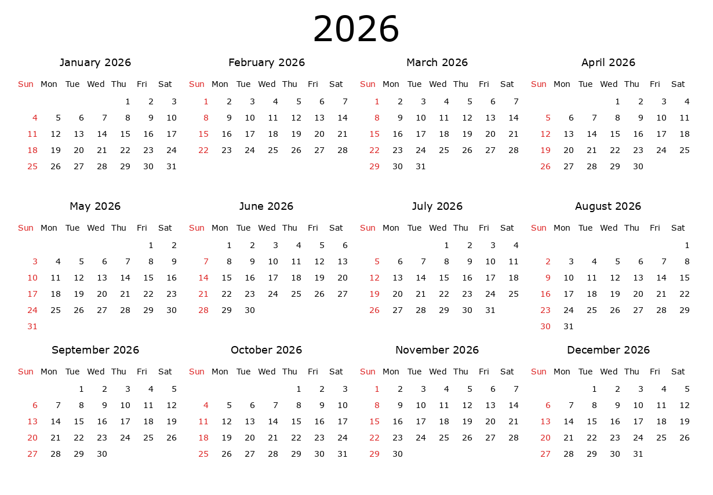

# 2026 Yearly Calendar Image Generator

This Python project creates a neatly formatted, multi-month calendar for the year 2026 and saves it as a PNG image file. The calendar displays all 12 months in a 4x3 grid with each month's Sundays colored red. The year title appears prominently at the top in a large Verdana font. The layout and design are customizable through the script settings.

## Features

- **Full year calendar**: Displays all months of 2026.
- **4 months per row, 3 rows**: Easy side-by-side comparison.
- **Beautiful title**: Large, centered "2026" at the top.
- **Sunday highlight**: Sundays in each month are displayed in red.
- **Right-aligned dates**: Consistent and professional appearance.
- **Fonts**: Uses Verdana (`verdana.ttf`) for all text for clarity and style.
- **Customizable**: Easily change fonts, colors, cell sizes, etc.
- **PNG output**: Saves the calendar as `calendar_2026.png` in your folder.

## Requirements

- Python 3.x
- [Pillow](https://pypi.org/project/Pillow/) (`pip install pillow`)
- Access to `verdana.ttf` font (for Windows: usually found in `C:\Windows\Fonts\verdana.ttf`)

## Usage

1. **Install dependencies:**
   ```bash
   pip install pillow
   ```

2. **Ensure `verdana.ttf` is available:**
   - On Windows, this is typically at `C:\Windows\Fonts\verdana.ttf`.

3. **Run the script:**
   ```bash
   python calendar_2026_image.py
   ```

4. **Output:**
   - A file named `calendar_2026.png` will be created, containing your calendar.

## Customization

- You can adjust font sizes, colors, and layout by modifying the variables at the top of the script.
- To use a different font, change the `verdana.ttf` path in the script to the desired `.ttf` font file.

## Example



## License

This project is open source and available under the [MIT License](LICENSE.MIT).

---
Generated by [@erangatennakoon](https://github.com/erangatennakoon).
